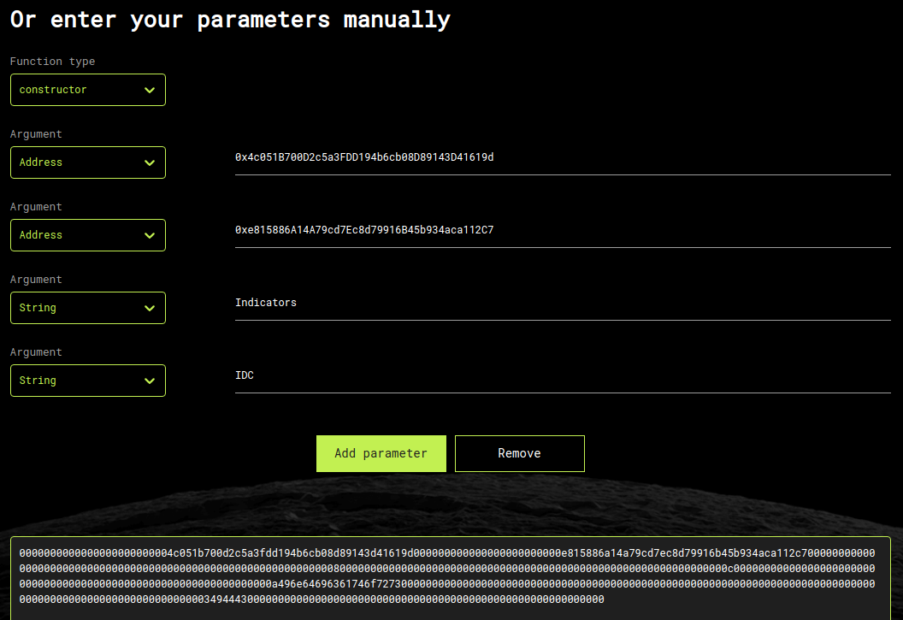

# Issue
One of my 3 contracts cannot be verified.  
` Error! Unable to generate Contract ByteCode and ABI`

# Context
Brownie v1.16.2 - Python development framework for Ethereum. Defaults 200 runs optimization `yes` License `3) MIT`.   
`pragma solidity 0.8.0;`  
Deployments are on Polygon.  

One library is deployed, and 3 contracts are linked to it.  
Besides that I published the lib twice. The contracts are linked to the first one.

# Addresses
Lib SvgCore: `[0xe0deF3F268f944f85152FeA51072D0c7eB1E9519](https://polygonscan.com/address/0xe0def3f268f944f85152fea51072d0c7eb1e9519#code)`  
(alternate lib, seems to be unsued `[0x908086809876E18673aDB1CA3C1a5f7d985311a3](https://polygonscan.com/address/0x908086809876e18673adb1ca3c1a5f7d985311a3#code)`)

First contract SvgTools : `[0xe815886A14A79cd7Ec8d79916B45b934aca112C7](https://polygonscan.com/address/0xe815886a14a79cd7ec8d79916b45b934aca112c7#code)`  
Second contract SvgWidgets : `[0x4c051B700D2c5a3FDD194b6cb08D89143D41619d](https://polygonscan.com/address/0x4c051B700D2c5a3FDD194b6cb08D89143D41619d#code)`  
Both of them were verified on polygonscan after the `Library_1` field was filled.   

Third contract, that cannot be verified: `[0x6F7880EeB7cf7123e7aCD93783C43CDa29B63C97](https://polygonscan.com/address/0x6f7880eeb7cf7123e7acd93783c43cda29b63c97)`

Constructor : 
``` 
contract Indicators is ERC721, ERC721URIStorage, ERC721Enumerable, Ownable { 
    constructor(address _SvgWigets, address _sTools) ERC721('Indicators', 'IDC')
```

# Unsuccessful attempts
Tested for each param set two times, with the first and the second library address.  
Added `// SPDX-License-Identifier: MIT` on top of the [flatten file](./flatten_indicators.sol)
With https://abi.hashex.org/ :
 - 4 Params : address(SvgWidgets) address(SvgTools) string(Indicators) String(IDC)
```
0000000000000000000000004c051b700d2c5a3fdd194b6cb08d89143d41619d000000000000000000000000e815886a14a79cd7ec8d79916b45b934aca112c7000000000000000000000000000000000000000000000000000000000000008000000000000000000000000000000000000000000000000000000000000000c0000000000000000000000000000000000000000000000000000000000000000a496e64696361746f72730000000000000000000000000000000000000000000000000000000000000000000000000000000000000000000000000000000000034944430000000000000000000000000000000000000000000000000000000000
```
 - 4 Params : string(Indicators) String(IDC) address(SvgWidgets) address(SvgTools)
```
000000000000000000000000000000000000000000000000000000000000008000000000000000000000000000000000000000000000000000000000000000c00000000000000000000000004c051b700d2c5a3fdd194b6cb08d89143d41619d000000000000000000000000e815886a14a79cd7ec8d79916b45b934aca112c7000000000000000000000000000000000000000000000000000000000000000a496e64696361746f72730000000000000000000000000000000000000000000000000000000000000000000000000000000000000000000000000000000000034944430000000000000000000000000000000000000000000000000000000000
```
How I generated


# Resolution:
With the 2 addresses only, after reading carefully the end of the string searched by polygonscan.
